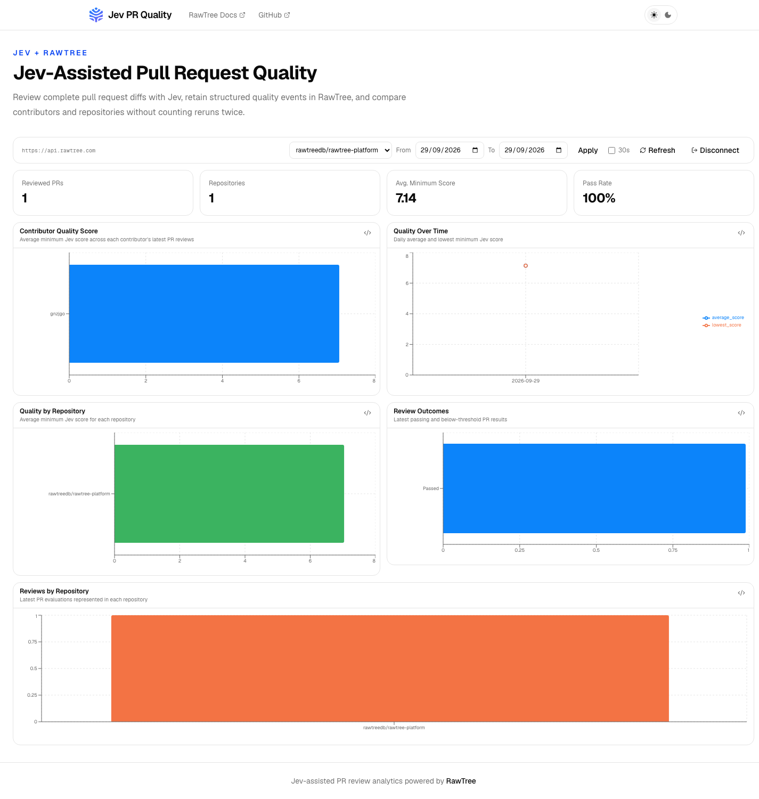

# Jev PR Quality

[](https://github.com/rawtreedb/jev-pr-quality/actions/workflows/ci.yml)
[](LICENSE)

**Jev-Assisted Pull Request Quality, visible over time.**

Jev PR Quality turns structured pull request reviews into an objective team
signal. The GitHub Action reviews every PR, comments with actionable scores,
and logs each result to RawTree. The self-hosted dashboard shows whether quality
is improving across contributors, repositories, and time.



## Why Jev?

Most AI code review produces prose: useful in the moment, difficult to compare,
and quickly lost in a PR timeline. Jev produces typed, repeatable ratings across
19 software-quality dimensions. That makes the review both actionable now and
measurable later.

Jev reviews the complete PR diff rather than a sample. A PR fails when any
applicable dimension falls below the threshold, so one critical weakness cannot
hide behind a good average. Tests remain the source of truth and humans retain
the final decision; Jev adds a consistent quality lens between them.

## How it works

```text
Pull request
    │
    ▼
Jev review ──────► PR comment + required check
    │
    ▼
RawTree event ───► Multi-repository dashboard
```

Jev evaluates the complete PR diff across 19 typed software-quality dimensions.
The GitHub Action publishes the result on the PR, optionally appends a structured
event to RawTree, and fails when any applicable dimension is below the configured
threshold. The included dashboard keeps only the latest run for each
`(repository, pull request)` before calculating scores.

- **One action:** review, comment, artifact, quality gate, and event logging.
- **Multi-repository by default:** compare an organization or focus on one repo.
- **Self-hosted frontend:** deploy with Node.js or Docker; no dashboard backend.
- **Safe token split:** CI gets a write-only key, viewers use read-only keys.
- **Resumable history:** backfill retained GitHub Actions review artifacts.

## Add the PR review

Create `.github/workflows/jev-review.yml` in each repository:

```yaml
name: Jev Review

on:
  pull_request:
    types: [opened, synchronize, reopened, ready_for_review, edited]

permissions:
  contents: read
  pull-requests: write

concurrency:
  group: jev-review-${{ github.event.pull_request.number }}
  cancel-in-progress: true

jobs:
  review:
    if: github.event.pull_request.head.repo.full_name == github.repository && github.actor != 'dependabot[bot]'
    runs-on: ubuntu-latest
    steps:
      - uses: actions/checkout@v5
        with:
          ref: ${{ github.event.pull_request.head.sha }}
          fetch-depth: 0
          persist-credentials: false

      - uses: rawtreedb/jev-pr-quality@main
        with:
          jev-api-key: ${{ secrets.JEV_API_KEY }}
          rawtree-api-key: ${{ secrets.RAWTREE_JEV_API_KEY }}
```

`@main` is the preview channel while the project is under review. Pin the first
stable `@v1` release when it is published.

Add `JEV_API_KEY` and a dedicated RawTree **write-only**
`RAWTREE_JEV_API_KEY` in Actions secrets. For multiple repositories, use
organization secrets scoped to the participating repositories. Every event
contains `github.repository`, so all repositories can safely write to the same
destination.

The defaults are the public convention and normally should not be changed:

| Setting | Default |
| --- | --- |
| Minimum score | `7` |
| RawTree API | `https://api.rawtree.com` |
| Table | `jev_pr_reviews` |
| Database | API key's default database |

Override the database, table, or endpoint only to isolate a private installation.
Never distribute a shared write token in a public workflow or frontend.

### Public dashboard, private data

The frontend itself is safe to publish. It contains no credentials and has no
server-side session or proxy. Each viewer supplies their own RawTree read-only
key, which remains in that browser tab's memory. Data visibility is therefore
controlled by the RawTree key—not by the deployment being public or private.

## Run the dashboard

Requirements: Node.js 24 and npm.

```sh
npm ci
npm run dev
```

Open <http://localhost:3000> and enter a RawTree **read-only** key. The key stays
in the browser tab's memory and is sent directly to `https://api.rawtree.com`.
It is never persisted or sent to the dashboard server.

The dashboard starts with all repositories combined and provides a repository
selector. It compares only real `jev_pr_review` events on rubric version `1`;
synthetic demo rows and unrelated records are excluded.

### Docker

```sh
docker build -t jev-pr-quality .
docker run --rm -p 3000:3000 jev-pr-quality
```

The image runs as an unprivileged user and contains no credentials. Put TLS in
front of it before asking users to enter read keys.

## Backfill retained reviews

The backfill reads retained `jev-review-*` GitHub Actions artifacts. It caches
downloads and checkpoints inserted event IDs, so interrupted runs are resumable.

```sh
export JEV_BACKFILL_REPOSITORY=owner/repository
export RAWTREE_JEV_API_KEY

# Inspect a small sample, then write it.
node scripts/jev-review/backfill-rawtree.mjs --limit=3
node scripts/jev-review/backfill-rawtree.mjs --limit=3 --write

# Later, fill the remaining retained history.
node scripts/jev-review/backfill-rawtree.mjs --write
```

Run the command once per repository. All repositories may target the default
table; repository identity is part of both the event ID and dashboard dedup key.

## What Jev receives

The action sends the PR title and body, the complete three-dot Git diff with 20
lines of context, and root `AGENTS.md` when present. It does not execute PR code
or upload the full repository. Large or binary diffs fail closed rather than
producing a partial, misleading review.

Jev is an advisory review signal that complements tests and human review. Scores
are model judgments, not proof of correctness. Historical comparisons should use
the same rubric and model period.

## Development

```sh
npm ci
npm run lint
npm run build
npm test
npm ci --ignore-scripts --prefix scripts/jev-review
npm test --prefix scripts/jev-review
```

## Attribution and licenses

Rubric data and question wording are adapted from
[NiazMorshed2007/jev-review](https://github.com/NiazMorshed2007/jev-review), commit
`57690af54ef7d862c2483342c1e61c14dffcf727`, under MIT. Its notice is retained in
[`scripts/jev-review/LICENSE`](scripts/jev-review/LICENSE). The rest of this
repository is licensed under Apache-2.0.
